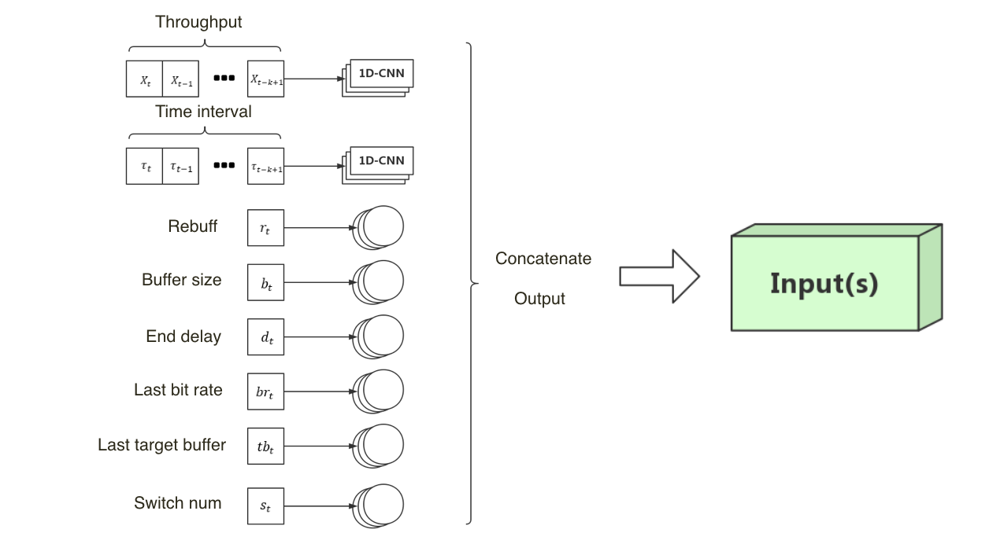
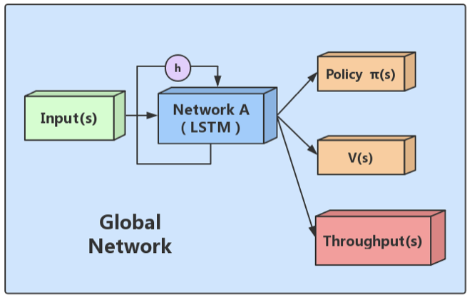
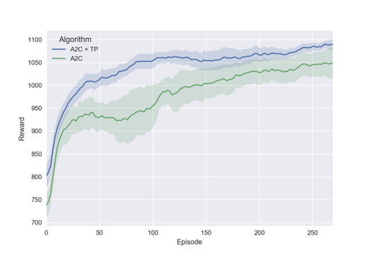

# AITrans_Competition
全球智能网络传输竞赛

# Dependency
> Tested in macOS and Linux

* OpenAI gym
* Tensorflow v1.11
* Python  3.6
* stable_baselines

# Our Alogrithm
**An Actor-Critic Approach with Auxiliary Network  for Adaptive Video Streaming**

## Construct Input

## The Architecture

Throughput 是一个很重要的特征，并且 Agent 的策略好坏不会影响 Throughput ，如果我们可以预知下一时刻的 Throughput，Agent 就可以利用这个信息做出更好的决策。

因此，我们添加了一个辅助网络，用来预测下一个时刻的 Throughput，它和策略价值网络一样，共享 Network A。辅助网络通过训练，能够更准确地预测 Throughput，同时 P V 网络也通过共享的 Network A 间接地提取到了更有用的高阶特征，从而增强整个 Model 的 表现。

## A2C + Throughput Prediction vs A2C

## REF

* [Neural Adaptive Video Streaming with Pensieve](http://web.mit.edu/pensieve/content/pensieve-sigcomm17.pdf)

* [Asynchronous Methods for Deep Reinforcement Learning](https://arxiv.org/abs/1602.01783)
